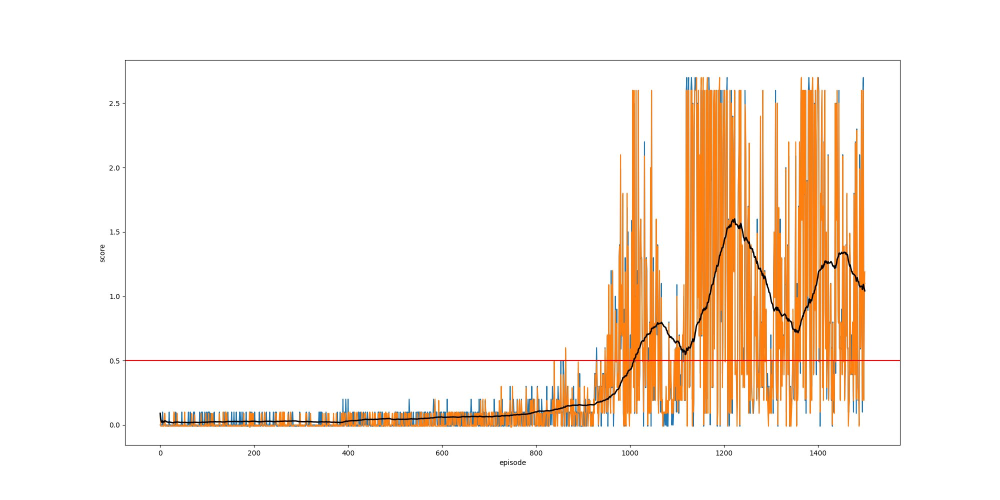

# Report

## Learning Algorithm

The learning algorithm is based on Multi-Agent Deep Deterministic Policy Gradient (MADDPG) algorithm based on [[1]](#maddpg_paper). In turn, the MADDPG algorithm is based on the Deep Deterministic Policy Gradient (DDPG) [[2]](#ddpg_paper) algorithm whose algorithm works as follows:

```
Initialize actor_local and actor_target networks
Initialize critic_local and critic_target networks
Initialize replay buffer of BUFFER_SIZE

For each episode:
    Reset all parallel environments, observe the initial states
    While none of the parallel episodes have ended:

        For each parallel environment:
            Use the Actor network to select an action given the current state, perturb action with NOISE
            Execute the selected action in the environment
            Observe the reward and next_state returned by the environment
            Store (state, action, reward, next_state) tuple in the replay buffer

        If current episode is a multiple of LEARN_EVERY:
            Repeat UPDATES_PER_LEARN times:
                Sample BATCH_SIZE samples from the replay buffer
                Update critic_local:
                    
                    Use critic_target to predict Q_expected from states and actions
                    
                    Use actor_target to select next_actions from next_states
                    Use critic_target to predict Q_targets_next from next_states and next_actions
                    Calculate TD bootstrapped Q_targets = rewards + Q_targets_next

                    Calculate MSE loss between Q_expected and Q_targets
                    Update critic_local network with gradient descent on the loss

                Update actor_local:
                    Use actor_local to select actions from states
                    Use critic_local to predict returns from states and actions
                    Set loss = -returns; Using the negative returns as the loss so that we maximize returns when minimizing loss
                    Update actor_local network with gradient descent on the loss

                Soft update of critic_target towards critic_local, with TAU as the interpolation coefficient
                Soft update of actor_target towards actor_local, with TAU as the interpolation coefficient
```

The above DDPG algorithm serves as the core of the agents, and can be used to simultaneously train two entirely independent agents to play tennis. However, totally independent training of the agents does not perform well since the DDPG algorithm is designed for single-agent RL, and is not able to deal with the non-stationarity of the environment (the evolution of other agents). 

Compared to the vanilla DDPG algorithm, this implementation simply modifies the algorithm such that the agents share a single replay buffer. For in-depth analysis and explanation of the MADDPG and its design, please refer to [[1]](#maddpg_paper).

#### Hyperparameters

```python
BUFFER_SIZE = int(1e6)  # replay buffer size
BATCH_SIZE = 128        # minibatch size
GAMMA = 0.99            # discount factor
TAU = 1e-3              # for soft update of target parameters
LR_ACTOR = 1e-3         # learning rate of the actor
LR_CRITIC = 1e-3        # learning rate of the critic
WEIGHT_DECAY = 0        # L2 weight decay
LEARN_EVERY = 20        # learn on every ?th step
UPDATES_PER_LEARN = 10  # perform ? updates per learn
EPSILON = 1.0           # explore->exploit noise process added to act step
EPSILON_DECAY = 0.9999  # decay rate for noise process
EPSILON_MIN = 0.01      # minimum epsilon for lifelong exploration
```

#### Network architecture

The Q-network has a simple architecture consisting of 2 fully-connected hidden layers between the input and output layers:
```
INPUT LAYER:        33 input state dimensions
HIDDEN LAYER 1:     Fully-connected layer of size 300
HIDDEN LAYER 2:     Fully-connected layer of size 200
OUTPUT LAYER:       4 output action dimensions
```
Between each layer, we apply a Rectified Linear Unit (ReLU). Additionally, we apply batch normalization on the output of the first hidden layer.

For the most part, the hyperparameters and network architecture follow those described in the DDPG paper [[2]](#ddpg_paper), and turned out to be sufficient to solve this environment.

## Results

The agent successfully solves the environment after 1000 episodes, where the moving average (over a 100-episode window) crosses the target of +0.5.



_The plot above shows the training progress over 1500 episodes, reaching the solved criteria at episode 1016 and improving up to a maximum score of +1.6. The orange and blue plots show the return of the two agents for each episode; the black plot is the maximum score of both agents over a moving average window of 100 episodes (at <100 episodes, the moving average is taken from episode 0 to the current episode); the red line indicates the threshold +0.5 where the environment is considered solved._

The following gif shows the final policies' successful performance on the task, after completing all 1500 training episodes:


To see the full progression of both agents training from scratch, check out [this video](https://youtu.be/KMBmxojIP58)!

## Future Work
Many possible improvements could be made to the algorithm.

#### Hyperparameter tuning
The current solution was chosen mostly following the DDPG paper implementation. It is likely that by running a large scale hyperparameter search (including model architecture search), it will be possible to improve the results for this particular environment.

#### Complete MADDPG implementation

This solution only partially implements the extensions described in [[1]](#maddpg_paper), namely the shared replay buffer for both agents. For a full implementation of the MADDPG algorithm, the following extensions can be added:
- Critic network of each agent should have an extended state input containing the joint state of all agents.
- In order to not rely on having the true observations and policies of other agents, we can learn an approximation of other agents’ policies via gradient updates as well.
- To obtain multi-agent policies that are more robust to changes in the policy of competing agents, train a collection of different sub-policies. For agent, we then maximize the ensemble objective (with uniform random selection from K sub-policies). Accordingly, maintain a separate replay buffer for each sub-policy.

## References
- <a name="maddpg_paper">[1]</a> Lowe, Ryan, et al. "Multi-agent actor-critic for mixed cooperative-competitive environments." Advances in neural information processing systems. 2017.
- <a name="ddpg_paper">[2]</a> Lillicrap, Timothy P., et al. "Continuous control with deep reinforcement learning." arXiv preprint arXiv:1509.02971 (2015).